# Hissr

The live project can be found [here]()

![Mockup image]

## Table of Contents
1. [About]
2. [Project Goals]
3. [User Stories]
4. [Design]
    - [Colours]
    - [Imagery]
    - [Wireframes]
5. [Front-end]
6. [Back-end API]
5. [Features]
6. [Technologies Used]
7. [Validation]
8. [Testing]
9. [Deployment]

## About

## Project Goals

## User Stories
1. As a user, I want the ability to sign up for an account so I can access all the site's features.
2. As a user, I want the ability to sign in to the site to use all its features.
3. As a user, I want the ability to view the navbar from every page so I can easily navigate around the site.
4. As a user, I want the ability to quickly see if I am logged in or not. 
5. As a user, I want the ability to stay logged in until I choose to log out.
6. As a user, I want the ability to view all of the most recent content so I can easily keep up to date.
7. As a user, I want the ability to keep scrolling through content without having to move to a different page.
8. As a user, I want the ability to create posts in order to interact with my community.
9. As a user, I want the ability to edit a post I have created. 
10. As a user, I want the ability to choose a location for a post I have created to better attract certain community members.
11. As a user, I want the ability to delete a post I have created.
12. As a user, I want the ability to create a quick post (a bolt) that users can like but not comment on.
13. As a user, I want the ability to edit a bolt that I have created.
14. As a user, I want the ability to choose a category for a bolt I have created.
15. As a user, I want the ability to delete a bolt I have created.
16. As a user, I want the ability to see all comments on a post.
17. As a user, I want the ability to comment on a post.
18. As a user, I want the ability to edit a comment I have made.
19. As a user, I want the ability to delete a comment I have made.
20. As a user, I want the ability to like a bolt.
21. As a user, I want the ability to unlike a bolt I have liked.
22. As a user, I want the ability to filter content by keywords.
23. As a user, I want the ability to upload a picture to my profile.
24. As a user, I want the ability to edit the content of my profile.
25. As a user, I want the ability to view other users' profiles.
26. As a user, I want the ability to follow other users so that I can search for content from those I follow.
27. As a user, I want the ability to see the most popular profiles.
28. As a user, I want the ability to filter content based on users that I follow.
29. As a user, I want the ability to see all a user's posted content on their profile page.
30. As a user, I want the ability to access different pages quickly without the whole page refreshing.
31. As a user, I want the ability to change my username and password.

### Wireframes

Sign up page

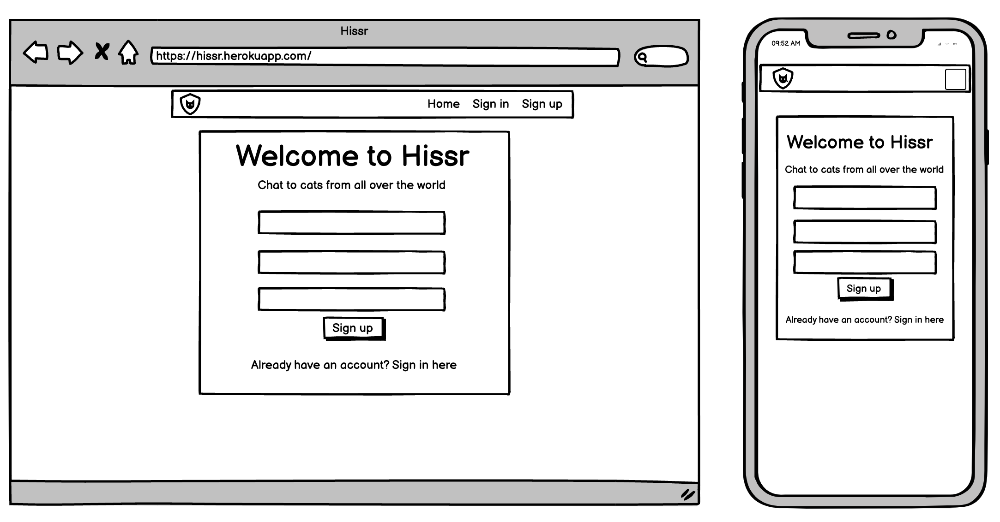

Sign in page

Home page

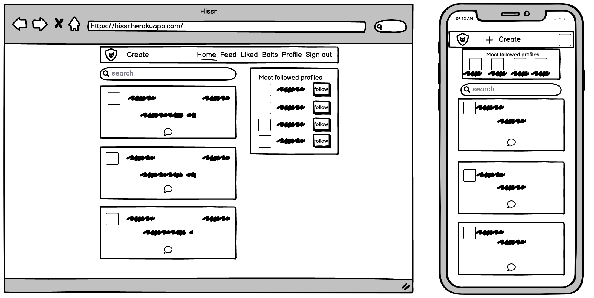

Post page

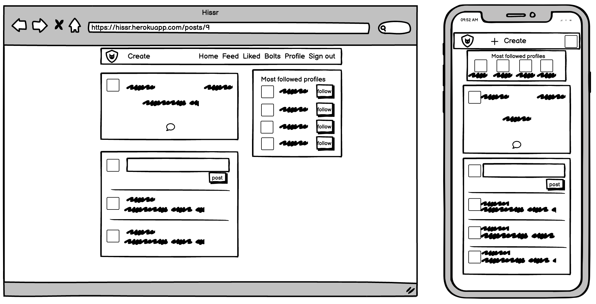

Create post

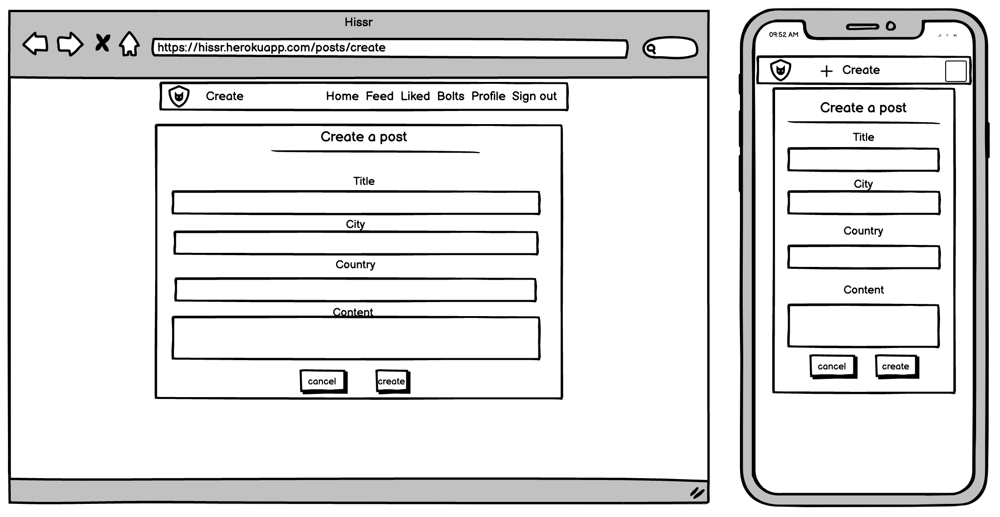

Edit post

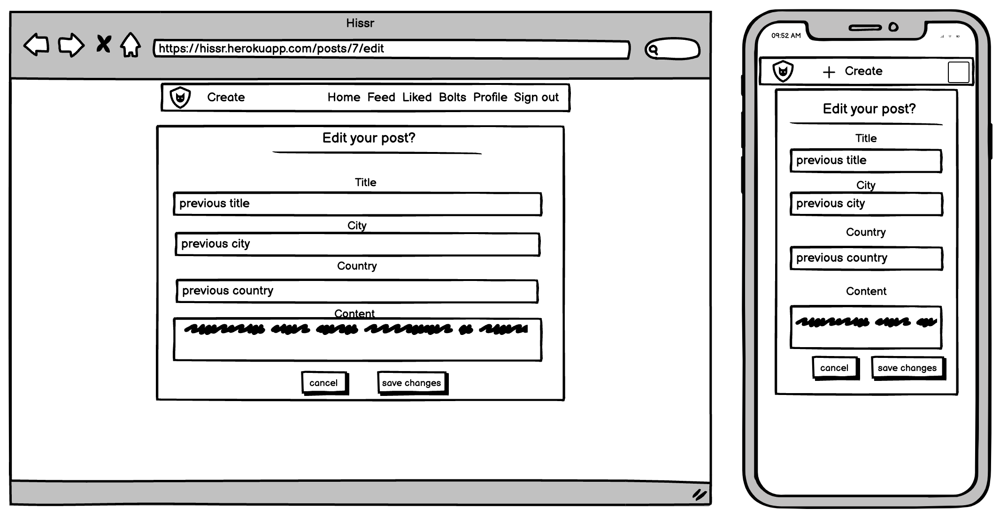

Feed

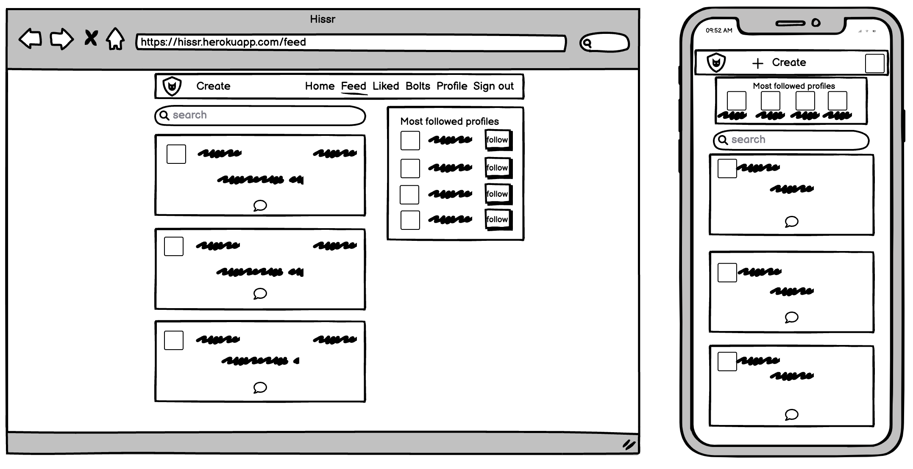

Liked

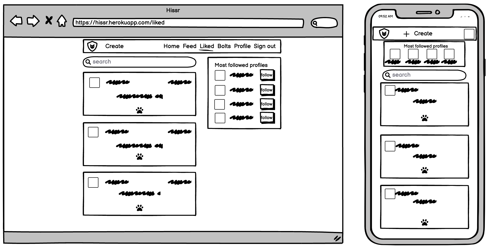

Bolts page

Bolt page

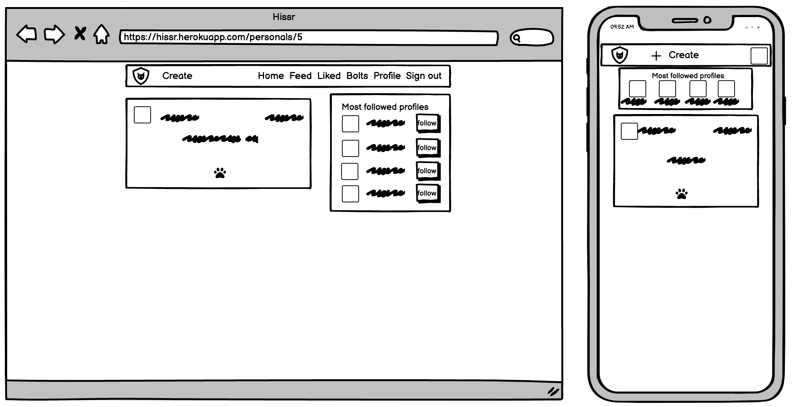

Create bolt

Edit bolt

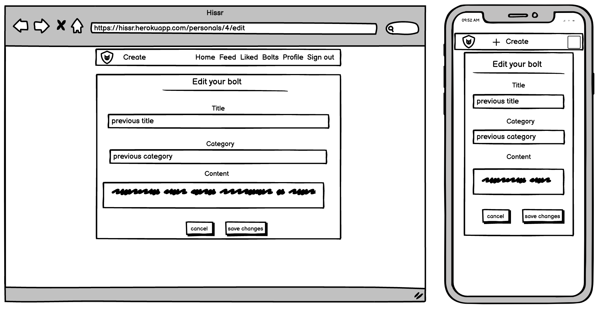

Profile

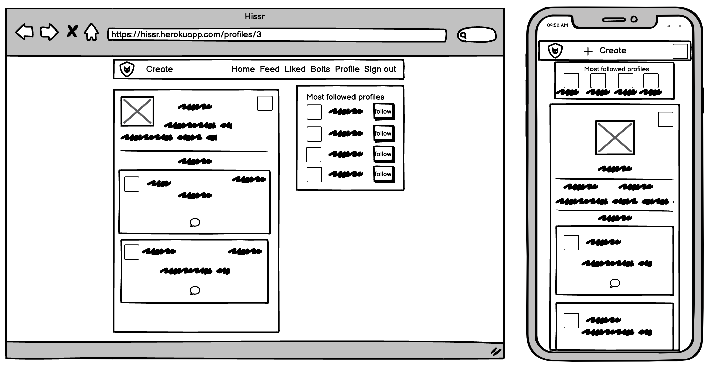

Edit profile

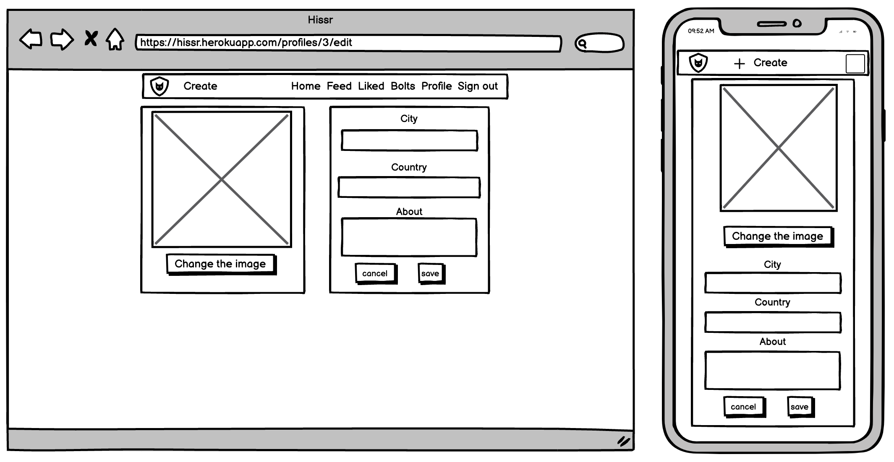

Change username

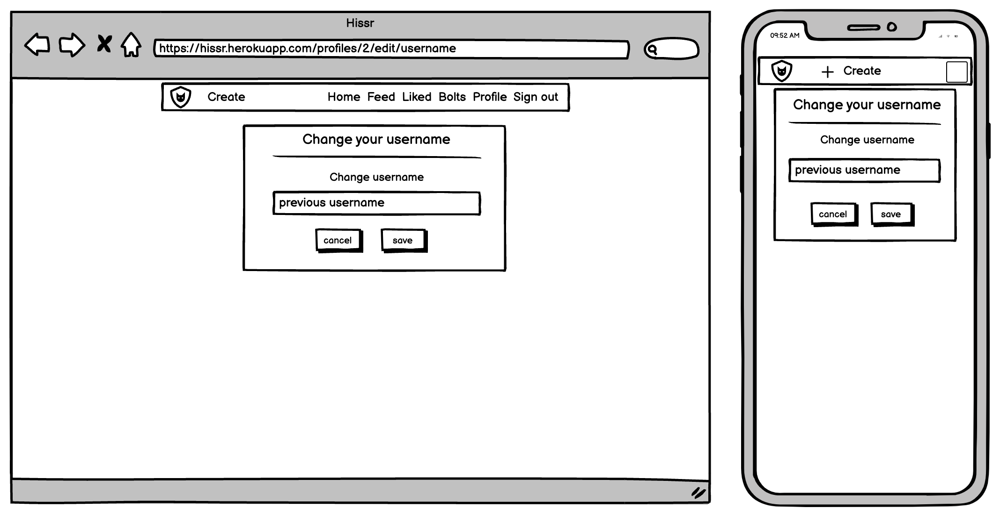

Change password

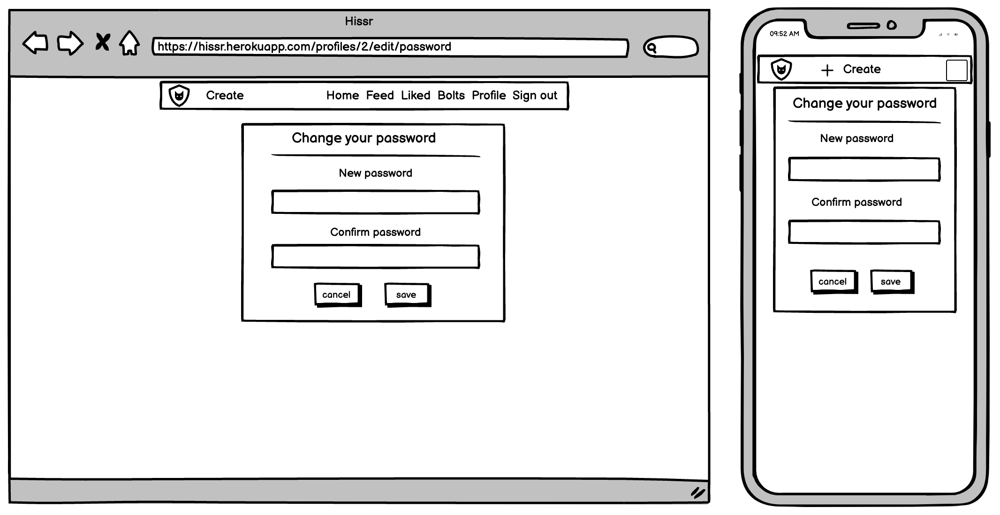

