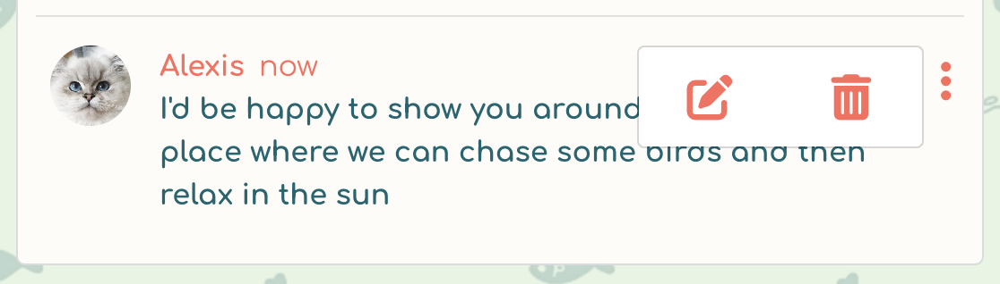

# Hissr

The live project can be found [here](https://hissr.herokuapp.com/).

![Mockup image]

## Table of Contents
1. [About](#about)
2. [Project Goals](#project-goals)
3. [User Stories](#user-stories)
4. [Design](#design)
    - [Colours](#colours)
    - [Imagery](#imagery)
    - [Wireframes](#wireframes)
5. [Front-end](#front-end)
6. [Back-end API](#back-end-api)
5. [Features](#features)
6. [Technologies Used](#technologies-used)
    - [Languages](#languages)
    - [Libraries, Frameworks & Dependencies](#libraries-frameworks-&-dependencies)
    - [Tools & Software](#tools-&-software)
7. [Validation](#validation)
8. [Testing](#testing)
    - [Testing User Stories](#testing-user-stories)
9. [Deployment](#deployment)
10. [Notes](#notes)

## About
Hissr is a content-sharing and social platform for cats around the world to connect and interact with each other. Users can create and comment on posts, create and like short-form posts, follow and unfollow users to curate their content feed, and edit their profiles to present themselves how they wish to their community.

## Project Goals
The goal for this project was to create a content-sharing platform for users from around the world to interact by creating posts, commenting on posts, liking content, and following other users. The intended tone is light and informal.

Key aspects:
- bright and cheerful design
- simple and intuitive navigation
- straightforward user authentication
- CRUD functionality for posts, comments, bolts, and images
- user interactions via comments and likes and follows
- data filtering by profiles followed, and content liked
- site responsiveness

I used an Agile methodology for planning this project, implemented using a Kanban board in Github Project with linked issues.  
View the Kanban board [here](https://github.com/users/wayne-AF/projects/9).
(Please see the [Notes](#notes) section concerning the numbering of User Stories on the Kanban board.)

## User Stories

### First sprint
#### Navigation
1. As a user, I want the ability to view and understand the site before I decide to create an account.
2. As a user, I want the ability to view the navbar from every page so I can easily navigate around the site.
3. As a logged-out user, I want the ability to easily sign in or sign up from wherever I am on the site.
#### Authentication
4. As a user, I want the ability to sign up for an account to use all the site’s features.
5. As a user, I want the ability to sign in with my login credentials.
6. As a user, I want the ability to stay signed in until I choose to log out.
7. As a user, I want the ability to quickly see if I am signed in or not.
### Second sprint
#### Posts
8. As a user, I want the ability to create a post in order to start a conversation with my community.
9. As a user, I want the ability to add a location to my post so that others can easily find posts from users in specific areas. 
10. As a user, I want the ability to edit my post to correct for errors.
11. As a user, I want the ability to delete my post in case I have changed my mind.
12. As a user, I want the ability to see all users’ posts with the most recent first, so that I can keep up-to-date with my community.
13. As a user, I want the ability to keep scrolling through content so I don’t have to move to a different page.
14. As a user, I want the ability to see a page with a single post and its comments.
#### Comments
15. As a user, I want the ability to make a comment on a post to be part of the conversation.
16. As a user, I want the ability to edit a comment I have made to correct for errors.
17. As a user, I want the ability to delete a comment I have made in case I have changed my mind.
18. As a user, I want the ability to search for posts based on username, post title, post content, or post location.
### Third sprint
#### Bolts
19. As a user, I want the ability to create a short post, a bolt, to express an idea or thought without the intention of starting a conversation.
20. As a user, I want the ability to add a category to my bolt, so that others can search for it based on this criterion.
21. As a user, I want the ability to edit my bolt to correct for errors.
22. As a user, I want the ability to delete my bolt in case I have changed my mind.
23. As a user, I want the ability to see all users’ bolts on their own page with the most recent first, so I can keep up-to-date with my community.
24. As a user, I want the ability to search for bolts based on username, bolt title, bolt content, or bolt category.
#### Likes
25. As a user, I want the ability to like a bolt to express my appreciation for its content.
26. As a user, I want the ability to unlike a bolt I have liked in case I have changed my mind.
27. As a user, I want the ability to see all the bolts I have liked on a single page to be able to quickly access the funny and interesting ones.
### Fourth sprint
#### Profile
28. As a user, I want the ability to upload a profile pictures so users can easily identify me.
29. As a user, I want the ability to edit the content of my profile so others can know more about me.
30. As a user, I want the ability to change my username.
31. As a user, I want the ability to change my password to maintain the security of my account.
#### Other profiles
32. As a user, I want the ability to view other users’ profiles in order to know more about them.
33. As a user, I want the ability to see the number of posts, bolts, followers, and followed on a user’s profile so that I can learn more about them.
34. As a user, I want the ability to see a user’s posts on their profile.
#### Follow
35. As a user, I want the ability to follow and unfollow a user to curate whose posts appear in my feed.
36. As a user, I want the ability to see the most followed profiles.
#### Other
37. As a user, I want the ability to receive feedback messages to tell me if my attempted action has been successful, e.g. updating a post or deleting a comment. 

## Design
### Wireframes

Sign up page

Sign in page

Home page

Post page

Create post

Edit post

Feed

Liked

Bolts page

Bolt page

Create bolt

Edit bolt

Profile

Edit profile

Change username

Change password

## Front-end
### 
React is an open-source front-end Javascript library for developers to easily create fast user interfaces for websites and applications based on individual and reusable components.

React was used for this project due to its:
- flexibility: React's modular structure makes it flexible and easier to maintain than other front-end frameworks
- reusability of components: repetition of code is kept to a minimum
- speed: React allows for the creation of applications with greater loading speeds, enhancing user experience
- React-Bootstrap: each Bootstrap component has been built as a React component, which makes them easy to implement and style

### Reused Components
- `<Asset />`: multipurpose component which displays different content depending on the props passed to it.
    - loading spinner when content is being loaded
    - image to indicate no results were found
    - message to indicate no results were found
    - User stories: 18, 24
- `<Avatar />`: component used to render profile images of different sizes and source images depending on the passed props.
    - User stories: 7, 28, 32, 36
- `<MoreDropdown />`: renders the dropdown menu for users to edit and delete their posts and bolts, edit their profile details, and change their username and password
    - User stories: 10, 11, 16, 17, 21, 22, 29, 30, 31
- `<NavBar />`: component that displays different content depending on whether the user is logged in or not. Logged in users see Create, Home, Feed, Liked, Bolts, Profile, and Sign out icons. Logged out users see Home, Sign in, and Sign up icons. The component displays on every page across the app.
    - User stories: 2, 3, 7
- `<PopularProfiles />`: component which displays the four more followed profiles in the app. Displayed are the user's avatar, user's name, and a follow/unfollow button. The button is only visible on larger screens.
    - User stories: 36

## Back-end API

## Features
### Homepage
- Displays the navbar, latest posts, most followed profiles
- All users can see all the most recent posts displayed here
- I did not feel that a dedicated landing page with site explanation was necessary. Internet users are very familiar with content-sharing and social-interaction sites like Twitter and Facebook, and because each component is clearly delineated, it is obvious to new users what kind of site Hissr is and who it is for.
- Logged-out users cannot see all pages of the site but they can view the most recent posts and get an idea of the tone of the site and if they'd like to sign up. The sign-in and sign-up links are also clearly visible in the navbar.
- Users can see how many comments each post has
- User stories: 1, 2, 3, 12

### Navbar
- Visible across all pages
- Contains the logo, site name, and tagline
- Displays the sign-in and sign-up links for logged-out users
- Displays the create, homepage, feed, liked, bolts, profile, and sign-out links to logged-in users
- Responsive and collapses to a toggler on smaller screens
- When collapsed on smaller screens, the create icon remains visible, enforcing the idea that the site is for content sharing and engagement
- When logged in, the navbar displays all the available pages for the user, as well as displaying the user's profile photo (if uploaded), letting them see at a glance whether they are logged in or not
- User stories: 2, 3, 7

### Sign up form
- Allows new users to create an account with a username and password
- Contains a welcome message and a tagline further explaining to the user that the site is for cats who wish to connect with cats all over the world
- Contains a link to the sign in page for users who already have an account
- User stories: 4

sign up form screenshot

### Sign in form
- Allows users with an existing account to log in
- Contains a welcome back message for returning users
- Contains a link to sign up for users who do not already have an account
- Brings the user to the homepage once log in is completed
- User stories: 5

sign in form screenshot

### Post create form
- Contains title, city, country, and content fields
- City and country fields are mandatory in order to help promote connecting with users in your community as well as all over the world and to make it easier for users to search for content by location
- The country names are listed as full names, but displayed as two-letter country codes in the published post
- The tagline encourages the user to start a conversation, reminding them about creating a dialogue and engaging with other users
- User stories: 8, 9

post create form screenshot

### Post edit form
- Is prepopulated with the information from the original post which the user can edit as they wish
- The tagline reminds the user that any edits they make might affect any conversation taking place in the comments on a post
- User stories: 10

post edit form screenshot

### Post detail page
- A page with a single post and all its details
- Also displays all of the post's comments
- This page allows the owner of the post to access its' edit and delete options from a dropdown menu in the upper-right corner of the post
- Users can create a comment on a post on this page
- User stories: 14, 15, 16, 17

post detail screenshot

post dropdown screenshot

### Comments
- Users can comment on any post by navigating to the post's detail page
- Elapsed time since the comment's creation is displayed in each comment
- Users can update or delete their comments via a dropdown menu
- Users can see the owner of each comment from the avatar and username on each comment
- User stories: 15, 16, 17

comment screenshot

comment dropdown screenshot

comment edit screenshot

### Bolt create form
- Users can create a short-form post with the intention of just expressing a thought or idea or recommendation without engaging in conversation
- Instead of location, users choose a category from a list of cat-related topics
- The tagline asks the question "something on your mind?" suggesting the idea of putting out a quick thought or idea
- User stories: 19, 20

bolt create screenshot

### Bolt edit form
- Is prepopulated with the information from the original bolt which the user can edit as they wish
- User stories: 21

bolt edit screenshot

### Bolt detail page
- A single bolt page where the bolt owner can access the edit and delete options
- User stories: 21, 22

bolt screenshot

bolt dropdown screenshot

### Bolts page
- Lists all the recently created bolts
- User stories: 23

### Likes
- A user can like a bolt in order to express their appreciation for its content
- A user can also unlike a bolt if they change their mind
- Users cannot like their own bolts
- Likes and unlikes can be performed on the bolts page and the bolt detail page
- A paw icon from FontAwesome is used in place of a heart icon for likes
- User stories: 25, 26

like screenshot

like own bolt screenshot

### Liked page
- A page displaying all the bolts a user has liked
- User stories: 27

### Feed page
- A page displaying all the posts from profiles that the user is following
- User stories: 35

### Profile page
- Displays the profile owner's name, their avatar, their statistics of content published and how many people they are following and being followed by
- It also displays the user's location and an about section, if provided by the profile owner
- Contains a dropdown menu for the user to edit the profile, change the username, and change their password
- Displays a list of the profile owner's recent posts
- Contains a follow/unfollow on other profiles
- User stories: 32, 33, 34

profile screenshot

profile dropdown screenshot

### Profile edit form
- Allows a user to upload a profile picture, to enter their location, and to write some personal text in the about section
- User stories: 28, 29

profile edit screenshot

### Username edit form
- Allows a user to update their username
- User stories: 30

username edit screenshot

### Password change form
- Allows a user to update their login password
- User stories: 31

password change screenshot

### Popular profiles
- Displays the four most-followed profiles from the site
- On larger screens it is on the right side of the screen, and on smaller screens it is across the top 
- On larger screens it contains follow/unfollow buttons
- Users can click on the profiles avatars or names to navigate to their profile pages
- User stories: 36

popular profiles large screen screenshot

popular profiles small screen screenshot

### Follow/unfollow
- Users can follow profiles so that any posts from those profiles will appear in the user's feed page
- Follow/unfollow buttons appear in the most followed profiles component on larger screen and on profile pages
- User stories: 35

### Search bar
- Users can filter the page's content based on keywords, e.g. username, location, title, etc.
- The search bar is available on the home, feed, liked, and bolts pages
- If no results are found, a message with accompanying image is displayed
- User stories: 18, 24

searchbar screenshot

searchbar no results screenshot

### Infinite scroll
- Allows the user to keep scrolling through content without having to change to a different page, improving user experience
- Used for posts, bolts, comments, bolts, and liked pages
- User stories: 13
### Feedback messages
- 

### Future Features

## Technologies Used
### Languages
- HTML5
- CSS3
- JavaScript
### Libraries, Frameworks & Dependencies
- [Axios](https://axios-http.com/docs/intro)
- [JWT](https://jwt.io/)
- [Popper](https://popper.js.org/)
- [React](https://17.reactjs.org/)
- [React-Bootstrap](https://react-bootstrap-v4.netlify.app/)
- [React Infinite Scroll](https://www.npmjs.com/package/react-infinite-scroll-component)
- [React Router](https://v5.reactrouter.com/web/guides/quick-start)
- [React-Toastify](https://www.npmjs.com/package/react-toastify)

### Tools & Software

## Validation

## Testing
### Testing User Stories
1. As a user, I want the ability to view and understand the site before I decide to create an account.

2. As a user, I want the ability to view the navbar from every page so I can easily navigate around the site.

3. As a logged-out user, I want the ability to easily sign in or sign up from wherever I am on the site.

4. As a user, I want the ability to sign up for an account to use all the site’s features.

5. As a user, I want the ability to sign in with my login credentials.

6. As a user, I want the ability to stay signed in until I choose to log out.

7. As a user, I want the ability to quickly see if I am signed in or not.

8. As a user, I want the ability to create a post in order to start a conversation with my community.

9. As a user, I want the ability to add a location to my post so that others can easily find posts from users in specific areas.

10. As a user, I want the ability to edit my post to correct for errors.

11. As a user, I want the ability to delete my post in case I have changed my mind.

12. As a user, I want the ability to see all users’ posts with the most recent first, so that I can keep up-to-date with my community.

13. As a user, I want the ability to keep scrolling through content so I don’t have to move to a different page.

14. As a user, I want the ability to see a page with a single post and its comments.

15. As a user, I want the ability to make a comment on a post to be part of the conversation.

16. As a user, I want the ability to edit a comment I have made to correct for errors.

17. As a user, I want the ability to delete a comment I have made in case I have changed my mind.

18. As a user, I want the ability to search for posts based on username, post title, post content, or post location.

19. As a user, I want the ability to create a short post, a bolt, to express an idea or thought without the intention of starting a conversation.

20. As a user, I want the ability to add a category to my bolt, so that others can search for it based on this criterion.

21. As a user, I want the ability to edit my bolt to correct for errors.

22. As a user, I want the ability to delete my bolt in case I have changed my mind.

23. As a user, I want the ability to see all users’ bolts on their own page with the most recent first, so I can keep up-to-date with my community.

24. As a user, I want the ability to search for bolts based on username, bolt title, bolt content, or bolt category.

25. As a user, I want the ability to like a bolt to express my appreciation for its content.

26. As a user, I want the ability to unlike a bolt I have liked in case I have changed my mind.

27. As a user, I want the ability to see all the bolts I have liked on a single page to be able to quickly access the funny and interesting ones.

28. As a user, I want the ability to upload a profile pictures so users can easily identify me.

29. As a user, I want the ability to edit the content of my profile so others can know more about me.

30. As a user, I want the ability to change my username.

31. As a user, I want the ability to change my password to maintain the security of my account.

32. As a user, I want the ability to view other users’ profiles in order to know more about them.

33. As a user, I want the ability to see the number of posts, bolts, followers, and followed on a user’s profile so that I can learn more about them.

34. As a user, I want the ability to see a user’s posts on their profile.

35. As a user, I want the ability to follow and unfollow a user so that specific users’ posts will appear in my feed.

36. As a user, I want the ability to see the most followed profiles.

37. As a user, I want the ability to receive feedback messages to tell me if my attempted action has been successful, e.g. updating a post or deleting a comment.

## Deployment

## Notes

